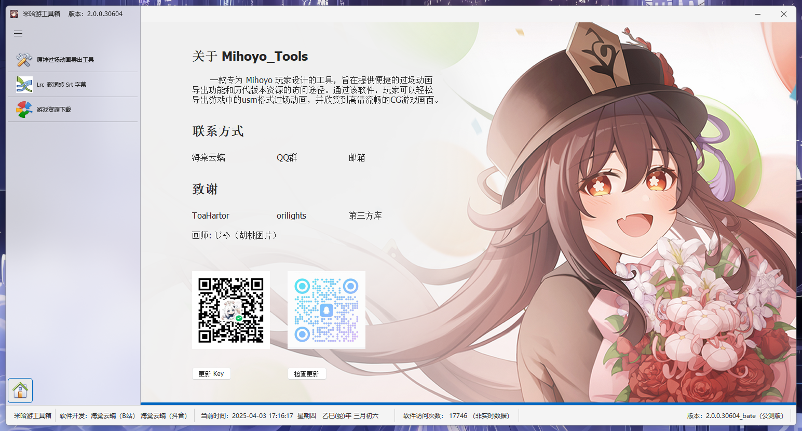
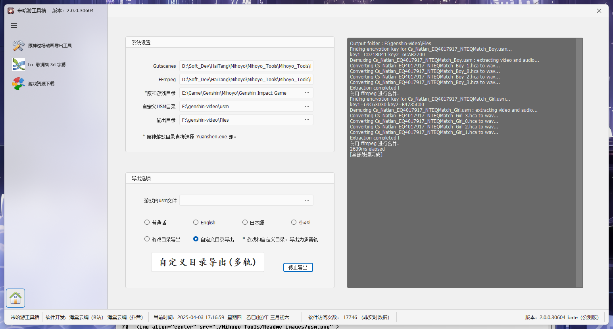
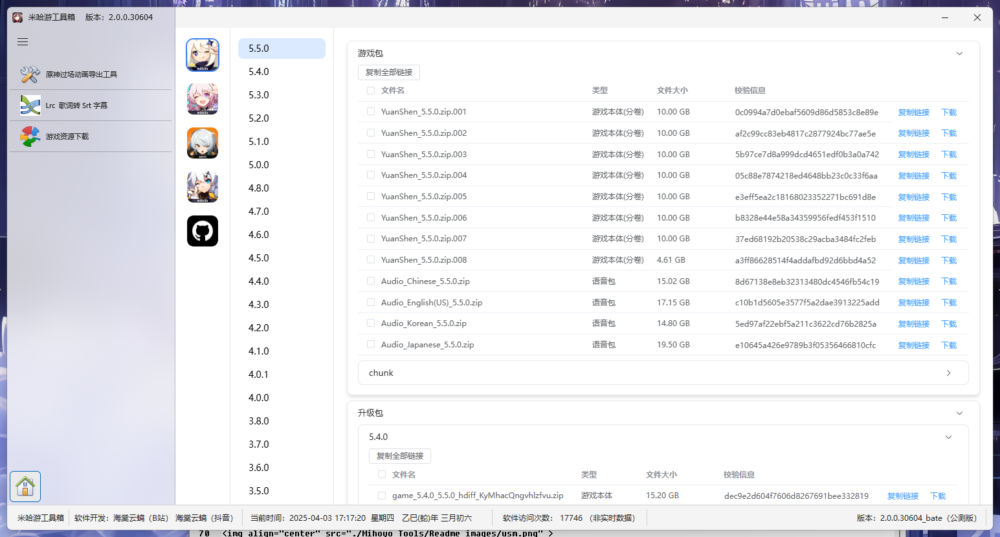

<h1 align="center">米哈游工具箱（原神过场动画导出工具）</h1>

<p align="center">
    
</p>
<p align="center">
    <strong> <a href="https://github.com/ToaHartor/GI-cutscenes">Genshin Cutscenes Demuxer</a> 的用户界面</strong>
</p>
<p align="center">
    </br>
</p>

## 软件截图(Screenshots):
<p align="center">

</p>
<BR>
<BR>

## Usage:
1. Download archive from [Release](https://gitee.com/haitangyunchi/Mihoyo_Tools/releases)
2. Start ```Setup.exe```Installed.

## FAQ

### Where are the game files with cutscenes?
`[Game directory]\Genshin Impact game\YuanShen_Data\StreamingAssets\VideoAssets\StandaloneWindows64`

### I have an error when demuxing files
Try to update your [GIcutscenes script](https://github.com/ToaHartor/GI-cutscenes/releases) to the latest version.<br>
Specify the path to the `GIcutscenes.exe` in the settings.


### I have an error in merging video
Try to update your [ffmpeg](https://github.com/BtbN/FFmpeg-Builds/releases) to the latest version.<br>
Add the `ffmpeg.exe` file next to the exe file you are running.

### There is no preview video after exporting
Try to update your [ffplay](https://github.com/BtbN/FFmpeg-Builds/releases) to the latest version.<br>
Add the `ffplay.exe` file next to the exe file you are running.
<BR>
<BR>

## 使用方法:
1. 从[Release](https://gitee.com/haitangyunchi/Mihoyo_Tools/releases)下载最新版本。
2. 双击运行 ```Setup.exe```安装即可。

## 常见问题

### 原神过场动画在游戏的那个文件夹?
`[游戏安装目录]\Genshin Impact game\YuanShen_Data\StreamingAssets\VideoAssets\StandaloneWindows64`

### 解密文件出错怎么办？
尝试更新 [GIcutscenes](https://github.com/ToaHartor/GI-cutscenes/releases)到最新版本，<br>
替换 `GIcutscenes.exe` 文件及可。

### 合并视频出错
尝试更新 [ffmpeg](https://github.com/BtbN/FFmpeg-Builds/releases) 到最新版本<br>
替换 `ffmpeg.exe` 文件到原有目录。

### 导出后没有播放预览
尝试更新 [ffplay](https://github.com/BtbN/FFmpeg-Builds/releases) 到最新版本<br>
替换 `ffplay.exe` 文件到原有目录。
<BR>
<BR>

<BR>

<BR>

<BR>

<BR>
<BR>